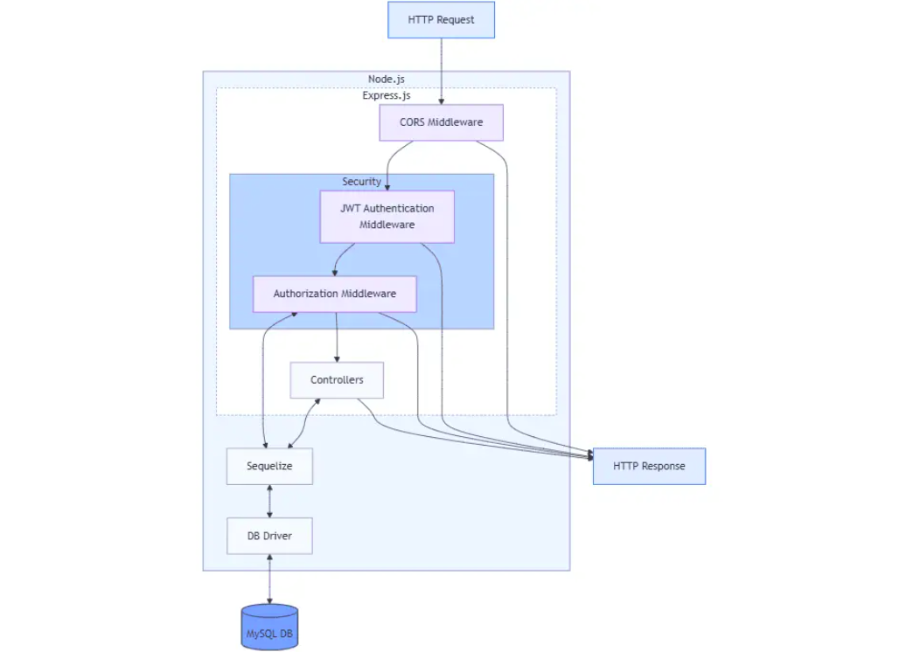
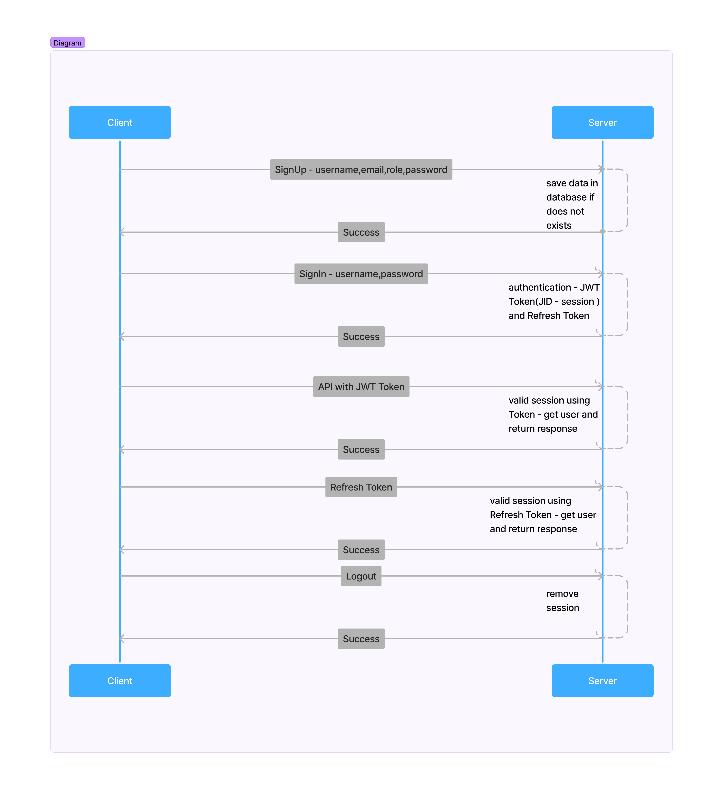

# Node JS  - API Setup - JavaScript MySQL

### 1. Node JS with JWT token
### 2. Mysql with sequelize
### 3. UAT and Prod setUp
### 4. Log Capture - winston
### 5. SignUp and Login API
### 6. CURD API
### 7. Encryption and Decryption
### 8. Version for API
### 9. Pagination and Search API
### 10. Upload File and Download File

### Postman Collection -> Project Directory -> Node-Sample.postman_collection.json

# Steps to create Node.js application - JavaScript

1. Create a new directory and initialize the Node.js application:

mkdir node-js-jwt-auth
cd node-js-jwt-auth
npm init -y

2. Install the necessary packages:

npm install express sequelize mysql2 cors jsonwebtoken bcryptjs
```
Node.js: Runtime environment.
Express 4: Web framework.
Sequelize 6: ORM for MySQL.
MySQL 8: Relational database.
JWT 9: Token-based authentication.
bcryptjs 2: Password hashing.
CORS 2: Cross-Origin Resource Sharing.
```

3. Ensure your package.json includes the following script:
```
"scripts": {
  "start": "node server.js"
}
```
4. Update package.json for ESModules
```
{
  ...
  "type": "module",
  ...
}
```
5. Project Structure
   
   Reference : (https://www.corbado.com/blog/nodejs-express-mysql-jwt-authentication-roles#5-project-structure)

```
backend/
├── app/
│   ├── config/
│   │   ├── auth.config.js
│   │   └── db.config.js
│   ├── controllers/
│   │   ├── auth.controller.js
│   │   └── user.controller.js
│   ├── middlewares/
│   │   ├── authJwt.js
│   │   └── verifySignUp.js
│   ├── models/
│   │   ├── index.js
│   │   ├── role.model.js
│   │   └── user.model.js
│   └── routes/
│       └── v1/
│           ├── auth.routes.js
│           └── user.routes.js
├── package.json
└── server.js
```



6. Start Server
```
npm start
```

